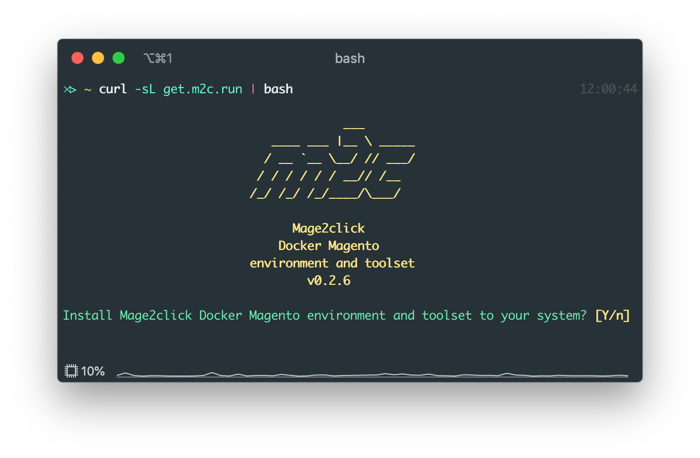

# Mage2click Docker Magento <br><small>environment and toolset</small>

<p align="center"></p>

<p align="center">
  <a href="https://github.com/magento/magento2" target="_blank"></a>
  <a href="https://hub.docker.com/r/mage2click/m2c/" target="_blank"></a>
  <a href="https://join.slack.com/t/mage2click/shared_invite/enQtNjE1Mjc0NDM3MjE4LWMwMjJjMTcyMmM1MzhkYmExNWIxMmNhYjY1ZDY3ZTM2MTk3ODlkZDY1ZjA5MjJkYjAyNGRiMGM3ODA3N2Y5MmI" target="_blank"></a>
  <a href="https://twitter.com/intent/follow?screen_name=mage2_click" target="_blank"></a>
</p>

Mage2click toolset is a system-wide command-line tool for managing simultaneously running docker Magento projects with insanely easy installation and configuration. It includes plenty of configurable services and useful commands for developing and projects orchestration right out of the box.

## Prerequisites

This setup assumes you are running Docker on a computer with at least 6GB of allocated RAM, a dual-core, and an SSD hard drive. 
 
This configuration has been tested on macOS. Linux based systems still require testing. Any testing are welcomed!

## Installation

To install Mage2click toolset to your system, simply run command below.

```bash
curl -sL raw.githubusercontent.com/mage2click/m2c/master/get | bash
```

Or shortened version of above.

```bash
curl -sL get.m2c.run | bash
```

For macOS systems, mutagen.io tool will be bundled in the toolset for high-performance files sync between host and docker containers.

## What is included

### Global system-wide services 

After toolset is installed, you will have the next tools available locally:

- Traefik - <a href="https://traefik.m2c.test" target="_blank">https://traefik.m2c.test</a>
- Portainer - <a href="https://portainer.m2c.test" target="_blank">https://portainer.m2c.test</a>
- Mailhog - <a href="https://mailhog.m2c.test" target="_blank">https://mailhog.m2c.test</a>
- Dnsmasq - <a href="https://dnsmasq.m2c.test" target="_blank">https://dnsmasq.m2c.test</a>

Toolset local homepage with links to all tools listed above - <a href="https://m2c.test" target="_blank">https://m2c.test</a>  

### Per-project services

Most of services are available with version on your choice.

All docker Magento projects initialized with: 

- Nginx
- PHP-FPM
- MariaDB
- Redis
- Xdebug

And optionally available:

- Varnish
- Elasticsearch
- phpMyadmin
- RabbitMQ 

## Usage

After toolset is installed on your system, you may use it to initialize new or existing magento projects.

### Interactive configuration mode

To initialize project, open the desired directory with terminal and run

```bash
m2c init
```

This command will launch project initialization in interactive mode. Simply follow the steps to configure the desired Docker Magento development environment.

### Commandline configuration mode

If at least one command argument is defined, automated setup will be started. All undefined parameters will be set with default values.

```bash
m2c init [parameters...] [flags...]
```

To get a list of all available parameters and flags run 

```bash
m2c init --help
```

## License

[MIT](LICENSE)